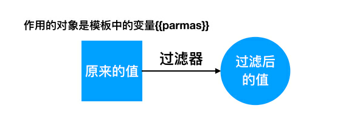

# 3.Flask模板

## Flask渲染Jinja2模板和传参：

1. 如何渲染模板：
   * 模板放在`templates`文件夹下
   * 从`flask`中导入`render_template`函数。
   * 在视图函数中，使用`render_template`函数，渲染模板。注意：只需要填写模板的名字，不需要填写`templates`这个文件夹的路径。
2. 模板传参：
   * 如果只有一个或者少量参数，直接在`render_template`函数中添加关键字参数就可以了。
   * 如果有多个参数的时候，那么可以先把所有的参数放在字典中，然后在`render_template`中，

     使用两个星号，把字典转换成关键参数传递进去，这样的代码更方便管理和使用。
3. 在模板中，如果要使用一个变量，语法是：`{{params}}`
4. 访问模型中的属性或者是字典，可以通过`{{params.property}}`的形式，或者是使用`{{params['age']}}`.

## 过滤器：

1. 介绍和语法：
   * 介绍：过滤器可以处理变量，把原始的变量经过处理后再展示出来。作用的对象是变量。
   * 语法：

     ```text
       {{ avatar|default('xxx') }}
     ```
2. default过滤器：如果当前变量不存在，这时候可以指定默认值。
3. length过滤器：求列表或者字符串或者字典或者元组的长度。
4. 常用的过滤器：

```text
abs(value)：返回一个数值的绝对值。示例：-1|abs 
default(value,default_value,boolean=false)：如果当前变量没有值，则会使用参数中的值来代替。示例：name|default('xiaotuo')——如果name不存在，则会使用xiaotuo来替代。
boolean=False默认是在只有这个变量为undefined的时候才会使用default中的值，如果想使用python的形式判断是否为false，则可以传递boolean=true。也可以使用or来替换。 
escape(value)或e：转义字符，会将<、>等符号转义成HTML中的符号。示例：content|escape或content|e。
first(value)：返回一个序列的第一个元素。示例：names|first 
format(value,arags,*kwargs)：格式化字符串。比如：
      {{ "%s" - "%s"|format('Hello?',"Foo!") }}
      将输出：Helloo? - Foo!
    last(value)：返回一个序列的最后一个元素。示例：names|last。
length(value)：返回一个序列或者字典的长度。示例：names|length。 
join(value,d=u'')：将一个序列用d这个参数的值拼接成字符串。 
afe(value)：如果开启了全局转义，那么safe过滤器会将变量关掉转义。示例：content_html|safe。 
int(value)：将值转换为int类型。 
float(value)：将值转换为float类型。 
lower(value)：将字符串转换为小写。 
upper(value)：将字符串转换为小写。 
replace(value,old,new)： 替换将old替换为new的字符串。 truncate(value,length=255,killwords=False)：截取length长度的字符串。 
striptags(value)：删除字符串中所有的HTML标签，如果出现多个空格，将替换成一个空格。 trim：截取字符串前面和后面的空白字符。 
string(value)：将变量转换成字符串。 
wordcount(s)：计算一个长字符串中单词的个数。
```




## if判断：

1. 语法：

   ```text
    
    
    
   ```

2. if的使用，可以和python中相差无几。

## for循环遍历列表和字典：

1. 字典的遍历，语法和`python`一样，可以使用`items()`、`keys()`、`values()`、`iteritems()`、`iterkeys()`、`itervalues()`

   ```text
    
        <p>{{ k }}：{{ v }}</p>
    
   ```

2. 列表的遍历：语法和`python`一样。

   ```text
    
        <p>{{ website }}</p>
    
   ```

## 继承和block：

1. 继承作用和语法：
   * 作用：可以把一些公共的代码放在父模板中，避免每个模板写同样的代码。
   * 语法：

     ```text
       
     ```
2. block实现：
   * 作用：可以让子模板实现一些自己的需求。父模板需要提前定义好。
   * 注意点：字模板中的代码，必须放在block块中。

## url链接：使用`url_for(视图函数名称)`可以反转成url。

## 加载静态文件：

1. 语法：`url_for('static',filename='路径')`
2. 静态文件，flask会从`static`文件夹中开始寻找，所以不需要再写`static`这个路径了。
3. 可以加载`css`文件，可以加载`js`文件，还有`image`文件。

   \`\`\`

   第一个：加载css文件

   第二个：加载js文件

   第三个：加载图片文件

   !\[\]\(\)

